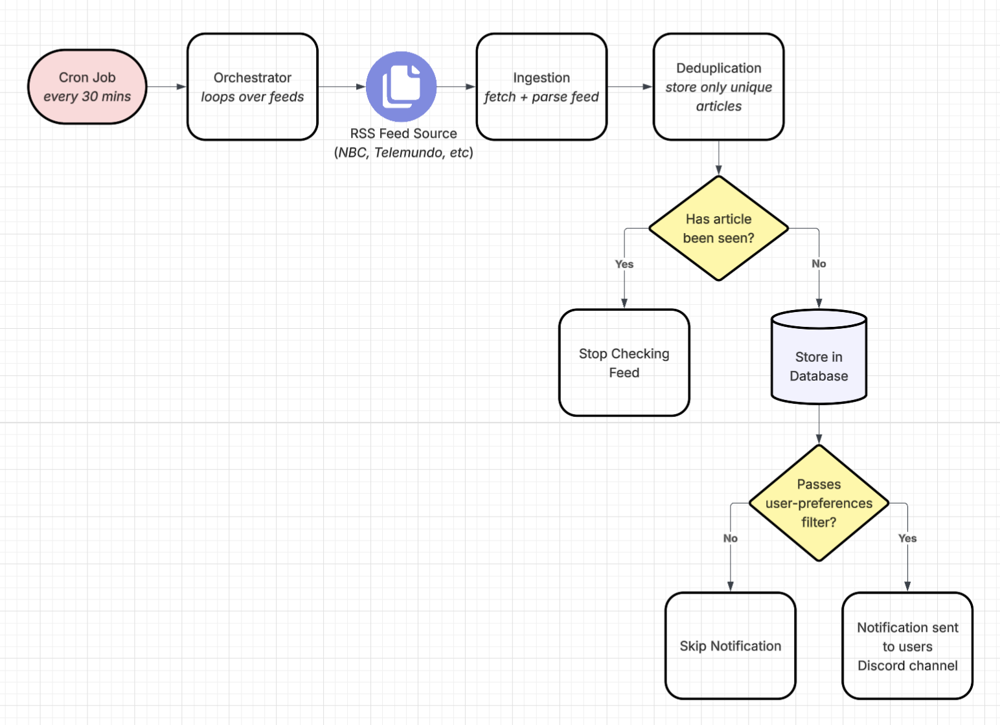

# News Feed
---

A lightweight, cron-scheduled backend service that ingests RSS feeds, filters articles with an LLM against user-defined preferences, and delivers notifications via Discord webhook. 

## How it Works



---

1. Cron triggers `main.py` on a schedule (*runs every 30 minutes*).
2. For each configured feed, `rss_reader.py` fetches the RSS XML and parses it into structured articles.
3. Each article's `guid` is checked against the database. Because feeds are newest first, hitting an already-seen `guid` means every article after it is guaranteed to have already been seen. The check stops there rather than scanning the whole feed every run.
4. New articles are inserted into the database.
5. Each new article is passed to an LLM along with a user-defined preference prompt. This decides whether it's relevant enough to notify on, acting as a filtration of articles.
6. Articles that pass are sent to a Discord channel via webhook.
7. On a feed's very first ever check, the newest article is silently stored (*no notification*) to avoid flooding the channel with the feed's entire existing history.


## Project structure

```
news-feed/
├── main.py                # entry point / orchestrator
├── rss_reader.py          # fetch + parse RSS feeds
├── db.py                  # database connection, init, insert, existence checks
├── notifier.py            # Discord webhook + LLM filtering
├── config.py              # centralized env variable loading
├── feed_config.py         # load/validate feeds.json
│
├── preferences/
│   ├── feeds.json         # list of {source, url} feeds to check
│   └── prompt.txt         # natural language filtering criteria for the LLM
│
├── sql/
│   └── schema.sql         # articles table definition
│
├── .github/
│   └── workflows/
│       └── deploy.yml     # CI/CD: SSH into VPS and pull latest on push to main
│
├── .env                   # environment variables (not tracked in git)
├── requirements.txt       # Python dependencies
├── .gitignore
└── README.md
```

## Tech Stack


| Concern       | Choice                          | Why                                                                                                                                                                                                                               |
|---------------|---------------------------------|-----------------------------------------------------------------------------------------------------------------------------------------------------------------------------------------------------------------------------------|
| Language      | Python 3.12                     | Familiar, high productivity language                                                                                                                                                                                              |
| Feed fetching | `requests`                      | Standard, minimal HTTP client that worked with the  low-frequency of calls per run                                                                                                                                                |
| Feed parsing  | `feedparser`                    | Normalizes inconsistent RSS/Atom formats across feeds                                                                                                                                                                             |
| Database      | SQLite                          | Single file, serverless design of SQLite matches the workload of this project (*one writer, low volume*), making a full client-server database unnecessary overhead with no current benefit                                       |
| Filtering     | Groq API (LLama 3.3 70B)        | Rich open source model library and a generous free tier offered by Groq. Llama 3.3 70B over smaller model because the filtering logic evaluates multiple conditions simultaneously which benefits from a larger model's judgement |
| Notifications | Discord Webhook                 | Discord is a platform I often use and no bot was needed, just a webhook                                                                                                                                                           |
| Scheduling    | Linux cron                      | A one-shot batch job, not a long-running service. Cron is the proportionate tool                                                                                                                                                  |
| Deployment    | Oracle Cloud (Always Free tier) | Permanent, no-cost VPS                                                                                                                                                                                                            |
| CI/CD         | GitHub Actions                  | Auto deploys on push to `main` via SSH into the VPS                                                                                                                                                                               |
> Note: originally used `llama-3.3-70b-versatile`. Groq deprecated this model and recommended `openai/gpt-oss-120b` as the migration path, which is now in use.
